# FieldEncoders.jl
Field encoding for Neural Radiance Fields (NeRF) in Julia. The implementation is based on [`Field Encoders`](https://github.com/nerfstudio-project/nerfstudio/blob/main/nerfstudio/field_components/encodings.py) in [`nerfstudio`](https://github.com/nerfstudio-project/nerfstudio/tree/main).

## 1. NeRF Encoder
```bash
$ julia scripts/visualize_nerfencoder.jl
```
### Input
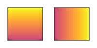

### Encoding 
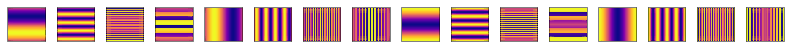

### Encoding with 0.01 covariance magnitude
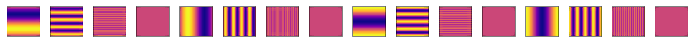

### Encoding with 0.1 covariance magnitude
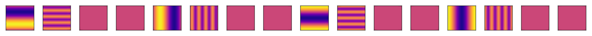

### Encoding with 1.0 covariance magnitude
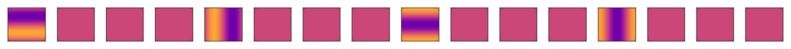

## 2. Hash Encoder
```bash
$ julia scripts/visualize_hashencoder.jl
```
### Input
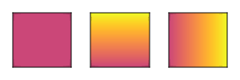

### Encoding 
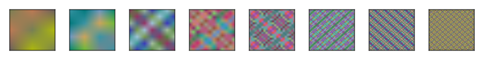

## 3. Spherical Harmonic Encoder
```bash
$ julia scripts/visualize_sphericalharmonicencoder.jl
```
### Level 1
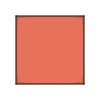

### Level 2
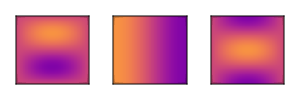

### Level 3
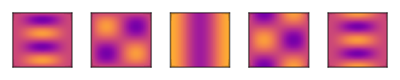

### Level 4
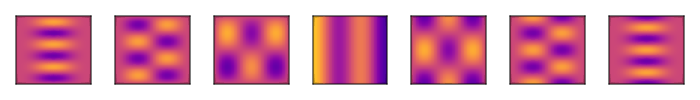

## Reference
- Matthew Tancik, Ethan Weber, Evonne Ng, Ruilong Li, Brent Yi, Terrance Wang, Alexander Kristoffersen, Jake Austin, Kamyar Salahi, Abhik Ahuja, David Mcallister, Justin Kerr, and Angjoo Kanazawa. 2023. Nerfstudio: A Modular Framework for Neural Radiance Field Development. In ACM SIGGRAPH 2023 Conference Proceedings (SIGGRAPH '23). Association for Computing Machinery, New York, NY, USA, Article 72, 1–12.